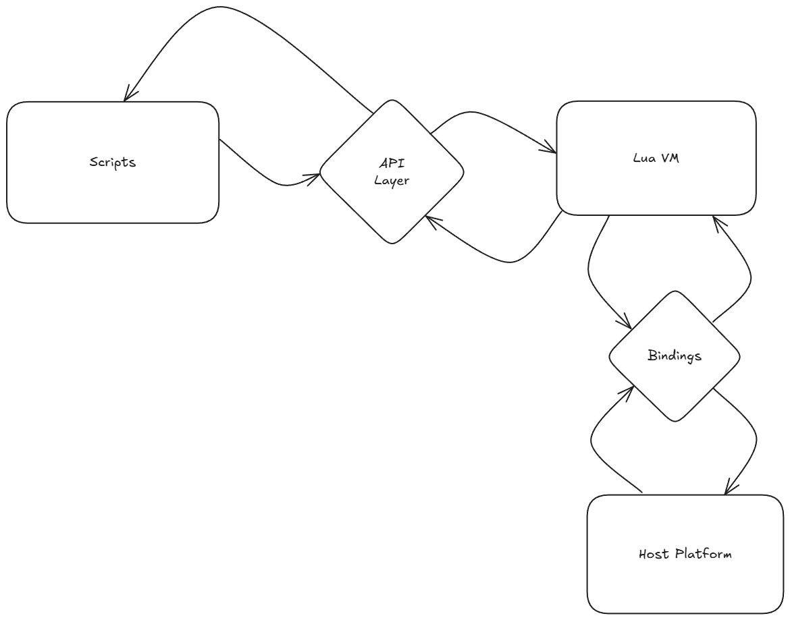

# Tangent

Hey there again! this section is dedicated to documentation about Tangent.
The custom modular game engine that Taxidus uses to process `Lua` scripts
from the server on the client.

Since Tangent is designed to be modular with the help of it's standard API
as long as a platform has a Lua VM, Tangent can be run on there albeit with
the bindings that are required for common execution.

## Architecture overview

Tangent primarly works by relying on the bindings that the Host platform provides
to the Lua VM.

This is because Tangent is primarly just a protocol or standard to
design common modular game engines on wherever `Lua` can run, so that users can
create assets without worrying about the implementation.

## Core concepts

Tangent is driven by some core concepts for it's design, these include:

1. **Script-Driven**: All game logic is written in Lua scripts
2. **Platform Agnostic**: Can run on any platform supporting a Lua VM
3. **Secure Execution**: Scripts run in isolated Lua VM environments
4. **Minimal Complexity**: Uses standard Lua instead of custom DSL

## Security model

### Script isolation

- Scripts run in sandboxed Lua environments
- Access to system resources is controlled by host bindings
- Memory usage can be limited by the host

### Trust boundaries

- Host must validate all script inputs
- Scripts must validate all host-provided data
- Communication happens only through defined interfaces